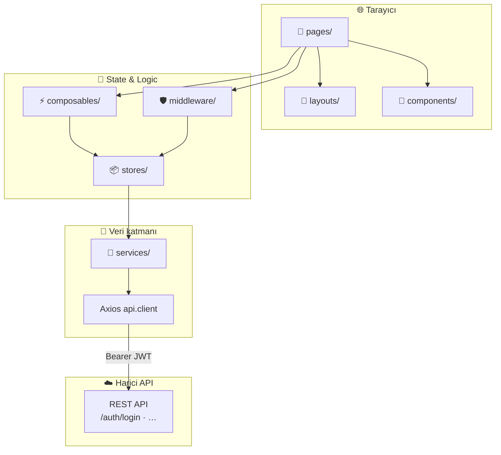
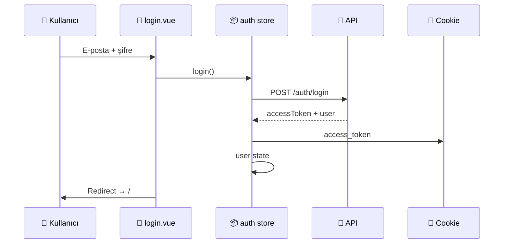

<div align="center">

# ⚽ Lineup — Web Frontend

**Amatör futbol maçlarını organize et · Oyuncuları yönet · İstatistikleri takip et**

[](https://nuxt.com/)
[](https://vuejs.org/)
[](https://www.typescriptlang.org/)
[](https://pinia.vuejs.org/)
[](https://sass-lang.com/)
[](https://axios-http.com/)

<br />

> 📱 Mobil öncelikli · Native app hissi · Production-ready mimari

Bu depo **yalnızca web frontend** uygulamasını içerir.  
Backend API ve mobil uygulama **ayrı repolarda** geliştirilir.

<br />

[](https://nodejs.org/)
[]()

</div>

---

## 📦 Kullanılan teknolojiler

<table>
  <tr>
    <td align="center" width="120">
      
      <br /><strong>Nuxt 3</strong>
      <br /><sub>Framework · SSR</sub>
    </td>
    <td align="center" width="120">
      
      <br /><strong>Vue 3</strong>
      <br /><sub>Composition API</sub>
    </td>
    <td align="center" width="120">
      
      <br /><strong>TypeScript</strong>
      <br /><sub>Strict mode</sub>
    </td>
    <td align="center" width="120">
      
      <br /><strong>Pinia</strong>
      <br /><sub>State management</sub>
    </td>
    <td align="center" width="120">
      
      <br /><strong>SCSS</strong>
      <br /><sub>Design tokens</sub>
    </td>
    <td align="center" width="120">
      
      <br /><strong>Axios</strong>
      <br /><sub>REST client</sub>
    </td>
  </tr>
</table>

| Katman | Teknoloji | Rol |
| :--- | :--- | :--- |
| 🖼️ **UI** | Vue 3 + SCSS | Bileşen tabanlı arayüz, scoped stiller |
| 🚀 **Framework** | Nuxt 3 + Nitro | Routing, SSR, `runtimeConfig`, auto-imports |
| 🧠 **State** | Pinia | Auth, kullanıcı oturumu |
| 🌐 **API** | Axios | JWT interceptor, merkezi hata yönetimi |
| ✅ **Kalite** | `vue-tsc` | Tip güvenliği, `npm run typecheck` |

---

## 🏗️ Mimari genel bakış

Lineup web uygulaması **katmanlı ve modüler** bir yapıda tasarlandı. Amaç: yeni özellikler (maçlar, kadrolar, profil) eklendikçe kod tabanının okunabilir ve ölçeklenebilir kalması.



### 🔐 Kimlik doğrulama akışı



| Adım | Açıklama |
| :---: | :--- |
| 1️⃣ | Kullanıcı `/login` sayfasında giriş yapar |
| 2️⃣ | `auth` store `authService.login()` çağırır |
| 3️⃣ | JWT `access_token` çerezine yazılır (`useCookie`) |
| 4️⃣ | Kullanıcı bilgisi Pinia + çerezde saklanır |
| 5️⃣ | `auth` middleware korumalı sayfalara erişimi kontrol eder |
| 6️⃣ | `401` yanıtında otomatik `/login` yönlendirmesi |

---

## 📁 Proje yapısı

```
lineup-web/
│
├── 📂 app/                          # Nuxt srcDir — tüm uygulama kodu
│   │
│   ├── 🎨 assets/styles/            # Global SCSS mimarisi
│   │   ├── abstracts/               # variables · mixins · breakpoints · media
│   │   ├── base/                    # reset · typography · globals
│   │   ├── utilities/               # yardımcı sınıflar
│   │   └── main.scss                # global giriş noktası
│   │
│   ├── 🧩 components/
│   │   ├── ui/                      # BaseButton · BaseInput · BaseAvatar · BaseCard
│   │   ├── core/                    # AppHeader · BottomNavigation
│   │   ├── layout/                  # PageHeader
│   │   ├── auth/                    # AuthCard
│   │   ├── match/                   # MatchCard
│   │   └── player/                  # PlayerCard
│   │
│   ├── ⚡ composables/               # useAuth — store facade
│   ├── 🖼️ layouts/                 # default (app shell) · auth (giriş ekranı)
│   ├── 🛡️ middleware/              # auth.ts · guest.ts
│   ├── 📄 pages/                    # index · login · error
│   ├── 🔌 plugins/                  # auth hydrate (oturum geri yükleme)
│   ├── 📡 services/                 # auth.service · api/api.client
│   ├── 📦 stores/                   # auth · user
│   ├── 📐 types/                    # auth · user · api
│   └── 🛠️ utils/                   # validators
│
├── 🌍 public/                       # favicon, statik dosyalar
├── ⚙️ nuxt.config.ts
├── 📋 package.json
└── 🔐 .env.example
```

### 🎨 Stil mimarisi

SCSS **katmanlı** yapıdadır; `variables`, `mixins`, `breakpoints` ve `media` her Vue bileşenine **otomatik enjekte** edilir — manuel `@use` gerekmez.

```scss
// Örnek: herhangi bir .vue dosyasında
.my-block {
  @include flex-center;
  @include card;
  padding: $space-lg;
  color: $color-primary;

  @include media-up(tablet) {
    gap: $space-xl;
  }
}
```

### 📱 Uygulama kabuğu (App Shell)

| Bileşen | Görev |
| :--- | :--- |
| `AppHeader` | Sabit üst bar, sayfa başlığı, profil avatarı |
| `BottomNavigation` | Sabit alt menü — native tab bar hissi |
| `default` layout | Scrollable içerik + safe-area desteği |
| `auth` layout | Giriş ekranı — hero + bottom sheet |

---

## 🚀 Kurulum

### Ön koşullar

| Gereksinim | Sürüm |
| :--- | :--- |
| **Node.js** | `>= 20` önerilir |
| **npm** | `>= 9` |
| **Backend API** | Lineup REST API erişilebilir olmalı |

### 1️⃣ Repoyu klonla

```bash
git clone <repo-url>
cd lineup-web
```

### 2️⃣ Bağımlılıkları yükle

```bash
npm install
```

> `postinstall` script'i otomatik olarak `nuxt prepare` çalıştırır ve `.nuxt/` tiplerini üretir.

### 3️⃣ Ortam değişkenlerini ayarla

```bash
cp .env.example .env
```

`.env` dosyasını düzenle:

```env
# Lineup backend API base URL
NUXT_PUBLIC_API_BASE_URL=https://lineup-api-beryl.vercel.app/api
```

| Değişken | Açıklama | Varsayılan |
| :--- | :--- | :--- |
| `NUXT_PUBLIC_API_BASE_URL` | REST API kök adresi | `http://localhost:8080/api` |

> ⚠️ `.env` dosyası `.gitignore` içindedir — **asla commit etmeyin.**

### 4️⃣ Geliştirme sunucusunu başlat

```bash
npm run dev
```

Tarayıcıda aç: **[http://localhost:3000](http://localhost:3000)**

- Oturum yoksa → `/login`
- Giriş başarılı → `/` (ana sayfa)

### 5️⃣ Production build (isteğe bağlı)

```bash
npm run build      # üretim derlemesi
npm run preview    # build önizlemesi
npm run typecheck  # TypeScript kontrolü
```

---

## 📜 NPM scriptleri

| Komut | Açıklama |
| :--- | :--- |
| `npm run dev` | 🔥 Geliştirme sunucusu (HMR) |
| `npm run build` | 📦 Production build (Nitro) |
| `npm run preview` | 👀 Build önizlemesi |
| `npm run generate` | 🗂️ Statik site üretimi |
| `npm run typecheck` | ✅ `vue-tsc` tip kontrolü |

---

## 🎯 Ürün hedefleri

| Hedef | Durum |
| :--- | :---: |
| 📱 Mobil öncelikli, native app hissi | ✅ |
| 🔐 JWT kimlik doğrulama + route guard | ✅ |
| 🧩 Yeniden kullanılabilir UI bileşenleri | ✅ |
| 📐 Ölçeklenebilir SCSS token sistemi | ✅ |
| ⚽ Maç / oyuncu / profil modülleri | 🔜 |

---

## 🔗 İlgili repolar

| Repo | Açıklama |
| :--- | :--- |
| **lineup-web** *(bu depo)* | 🌐 Web frontend |
| **lineup-api** | ☁️ Backend REST API |
| **lineup-mobile** | 📱 Mobil uygulama |

---

<div align="center">

**Lineup** · v0.1 · Made with ⚽ & 💚

</div>
